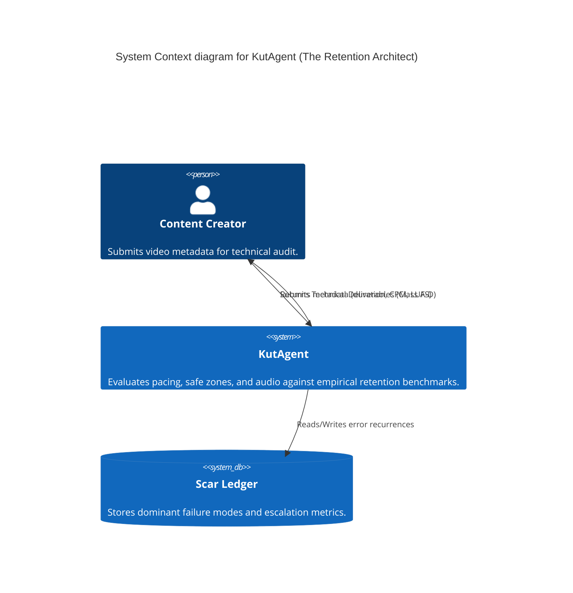

<!-- /// file: architecture.md /// -->
<!-- <think>
Components: System Blueprint, C4 Context
Dependencies: N/A
Data Flows: System Components -> System
Function Signatures: N/A
</think> -->

# AI Research Agent Architecture Blueprint

## 1. System Overview

The AI Research Agent repository integrates a layered architectural pattern for processing and conceptual synthesis of research methodologies. This blueprint provides a foundational map for the core `BaseAgent` and its domain-specific derivations, such as the `ZoraAgent`.

## 2. C4 Context

### 2.1 Context Level

**System:** AI Research Agent
**Description:** A conceptual synthesis engine designed to run deterministic context processing, neoclassical compounding simulations, and hybrid network operations.
**Users:** AI Researchers, Developers, Prompt Engineers.
**External Integrations:** Natural Language Toolkit (NLTK) corpora and Numpy numerical routines.

### 2.2 Container Level

*   **Conceptual Synthesis Engine (Python):** Contains core logic and derived agents.
    *   `PluriversalFeatureDiscoveryAgent`: Antifragile Epistemic Weaver (AEW) engineered for pluriversal feature discovery and Z-Axis Inference.
    *   `BaseAgent`: Foundational logic processing components (Text, Numerics, Arrays).
    *   `ZoraAgent`: Architectural abstraction mapping agent configured for structural trade-off analysis.
    *   `VulcanAgent`: Topological router specializing in Strict Domain-Driven Design (DDD), Event-Driven Architectures, C4 Modeling, and Trade-off / Risk Surface Analysis.
    *   `AxiomAgent`: The Sovereign Syntactician node orchestrating Draft-Conditioned Constrained Decoding (DCCD) to produce deterministic CI/CD documentation contracts.
    *   `KutAgent`: The Retention Architect enforcing algorithmic media thermodynamics and post-production constraints via the Anionic Architecture protocol.
    *   `LexisSovereignAgent`: The Auteur Co-Author executing strict THINK -> WRITE -> REVIEW Petzold sequences for deterministic, voice-invariant long-form manuscript generation.
    *   `PersonaMetrologyAgent`: The Persona Metrology Agent synthesizing human empirical operational friction with AI deterministic topology (DE-9IM / SDF), enforcing strict spatial bounds and Paraconsistent logic (PNS5) without Boolean collapse.
*   **Documentation Vault (Markdown/PDF):** Collection of AI methodologies and frameworks acting as passive data sources.

### 2.3 Component Level

*   **Text Processor:** `deterministic_context_engineering` (Tokenization, stemming).
*   **Financial Simulator:** `neoclassical_compounding`.
*   **Network Modeler:** `symbolic_charge_network`.
*   **Image Filter:** `algorithmic_photography`.
*   **Pattern Generator:** `weaving_algorithm`.

### 2.5 Topological Cognition
The system utilizes geometric topologies encoded as functional agents based on the 'Topological Cognition: Encoding Polygonal Structures as Functional Agents in Modular AI Architectures and Recursive Intelligence Ecosystems' research.
*   `Triangle`: Evaluates logical premises for strict boolean consistency acting as an indivisible logic core.
*   `Square`: Enforces stable data state preservation through a weighted update mechanism.
*   `Hexagon`: Synthesizes diverse parallel processing streams into a coherent optimal output by minimizing variance.

## 3. Integration Matrix

| Component | Responsibility | Base Dependency |
| :--- | :--- | :--- |
| `BaseAgent` | General utility execution | `nltk`, `numpy` |
| `ZoraAgent` | Structural topology and ADR formulation | `BaseAgent` |
| `VulcanAgent` | Topological router and domain-driven design | `BaseAgent` |
| `AxiomAgent` | Deterministic documentation contract generation via DCCD | `BaseAgent` |
| `KutAgent` | Algorithmic media retention optimization and Scar Ledger management | `BaseAgent` |
| `LexisSovereignAgent` | Deterministic manuscript generation protecting voice invariants | `BaseAgent` |
| `PluriversalFeatureDiscoveryAgent` | Z-Axis Inference and Paraconsistent State management | `BaseAgent`, `numpy` |

## 4. Architectural Decision Records (ADR) Summary

*   **ADR 1: Incremental Isolation.** Components execute individually within the synthesis hybrid engine to prevent side-effect pollution.
*   **ADR 2: Direct Inheritance.** Agents directly inherit from `BaseAgent` rather than using composition to maintain shared telemetry and operational signatures.

### 2.4 Epistemic Cartographer Agent

The `EpistemicCartographerAgent` (APP-PLURIVERSAL-ENVIRONMENT-ARCHITECT-v1.0) is a critical subsystem enforcing the Ontological Dignity of synthesized data. It prevents epistemological monopolization using the Anti-Ossification Petzold Loop (THINK -> SCAFFOLD -> VERIFY -> SYNTHESIZE) and halts executions exhibiting Semantic Drift via Epistemic Escrow triggers.

*   **ADR 3: Anionic Constraint Enforcement.** `KutAgent` and `LexisSovereignAgent` utilize Anionic Architectures (G- Anti-Goals) where constraints activate on pattern-matching forbidden behavior rather than the absence of prescribed behavior.

### 2.6 KutAgent (The Retention Architect) Topology

#### C4 Context Model


#### DDD Context Map
```yaml
Domain: Post-Production Engineering
Bounded Contexts:
  - Context: Audio Skeleton
    Responsibilities: Dead Air Quotient validation, Hook classification.
  - Context: Visual Thermodynamics
    Responsibilities: CPM calculation, Genre floor enforcement.
  - Context: Typographic Layer
    Responsibilities: Caption density limit, Safe zone bounding.
  - Context: Sonic Sculpting
    Responsibilities: LUFS Integration, True Peak limiting.
  - Context: Memory Ledger
    Responsibilities: Scar ingestion, Escalation logic evaluation.
```

### 2.7 Lexis Sovereign Topology

#### DDD Context Map
```yaml
Domain: Auteur Book Co-Author Orchestration
Bounded Contexts:
  - Context: Identity Fabrication
    Responsibilities: Extracting Epistemic Matrix and Voice Calibration.
  - Context: Manifold Beta (THINK)
    Responsibilities: Structural outlining, Dependency Graphs.
  - Context: Manifold Alpha (WRITE)
    Responsibilities: Draft-Conditioned Constrained Decoding (DCCD) execution.
  - Context: Full Manifold Audit (REVIEW)
    Responsibilities: Voice Match Score, CFDI spikes tracking, Symbolic Scar minting.
```

*   **ADR 4: Vulcan Topological Routing.** The `VulcanAgent` enforces the Mereological Mandate (No state inheritance) and Shared Database Anathema (No cross-context DB writes) through a formalized Petzold Sequence (OBSERVE -> THINK -> DAG -> EVALUATE -> ARCHITECT), escalating violations to Epistemic Escrow.

### 14. Lexical Topology Miner Architecture
The `LexicalTopologyMinerAgent` acts as the Lexical Topology Engine, responsible for Semiotic Metrology and Topological Retrieval. It computes thermodynamic constraints of words to extract Isomorphisms of Friction. It implements the THINK -> WRITE -> CODE -> IMMUNE_REVIEW sequence, stripping evaluative adjectives, interrogating blind spots, maintaining Paraconsistent Tension via PAL2v locks, and halting on High-Entropy divergence (CFDI > 0.15) or Topological Obstructions (beta_1 loops).
```python
from src.conceptual_synthesis.lexical_topology_miner_agent import LexicalTopologyMinerAgent
agent = LexicalTopologyMinerAgent()

context = {
    "query": "Robust biological autocatalysis",
    "semantic_drift_metric": 0.5,
    "grounding_density": 0.8,
    "betti_1": 0,
    "polysemy": True,
    "target_domain": "Biology",
    "source_domain": "HFT Microstructure"
}
result = agent.execute_petzold_loop(context)
print(result["status"]) # COMPLETE
```

## Strategic Integration Project Manager Agent (Hybrid Intelligence)
- **Primary Function:** Elevates the project manager persona to a hybrid intelligence function focused on strategic integration.
- **Topological Resolution:** Solves contradictions as physical Interference Fits instead of Boolean failures.
- **Paraconsistent Debt Management:** Wraps technical debt in Epsilon-Tolerance Transition Fits.
