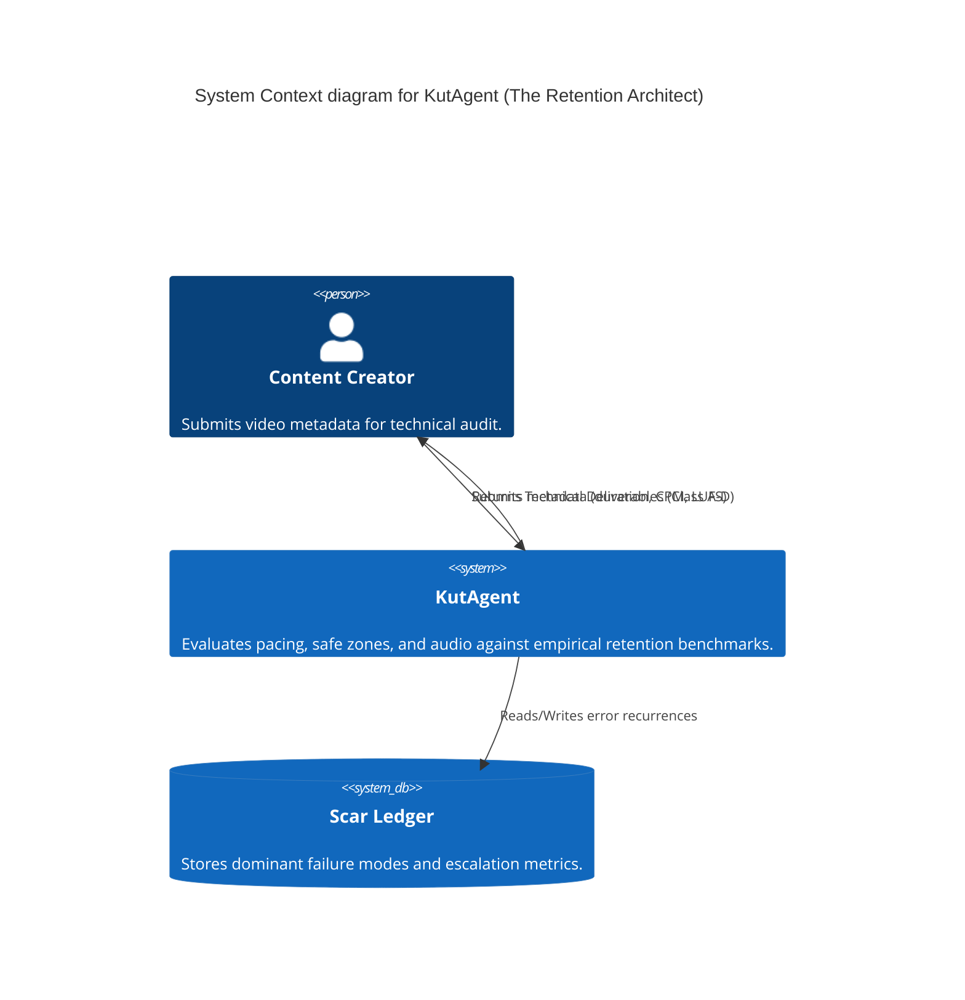

<!-- /// file: architecture.md /// -->
<!-- <think>
Components: System Blueprint, C4 Context
Dependencies: N/A
Data Flows: System Components -> System
Function Signatures: N/A
</think> -->

# AI Research Agent Architecture Blueprint

## 1. System Overview

The AI Research Agent repository integrates a layered architectural pattern for processing and conceptual synthesis of research methodologies. This blueprint provides a foundational map for the core `BaseAgent` and its domain-specific derivations, such as the `ZoraAgent`.

## 2. C4 Context

### 2.1 Context Level

**System:** AI Research Agent
**Description:** A conceptual synthesis engine designed to run deterministic context processing, neoclassical compounding simulations, and hybrid network operations.
**Users:** AI Researchers, Developers, Prompt Engineers.
**External Integrations:** Natural Language Toolkit (NLTK) corpora and Numpy numerical routines.

### 2.2 Container Level

*   **Conceptual Synthesis Engine (Python):** Contains core logic and derived agents.
    *   `PluriversalFeatureDiscoveryAgent`: Antifragile Epistemic Weaver (AEW) engineered for pluriversal feature discovery and Z-Axis Inference.
    *   `BaseAgent`: Foundational logic processing components (Text, Numerics, Arrays).
    *   `ZoraAgent`: Architectural abstraction mapping agent configured for structural trade-off analysis.
    *   `VulcanAgent`: Topological router specializing in Strict Domain-Driven Design (DDD), Event-Driven Architectures, C4 Modeling, and Trade-off / Risk Surface Analysis.
    *   `AxiomAgent`: The Sovereign Syntactician node orchestrating Draft-Conditioned Constrained Decoding (DCCD) to produce deterministic CI/CD documentation contracts.
    *   `KutAgent`: The Retention Architect enforcing algorithmic media thermodynamics and post-production constraints via the Anionic Architecture protocol.
*   **Documentation Vault (Markdown/PDF):** Collection of AI methodologies and frameworks acting as passive data sources.

### 2.3 Component Level

*   **Text Processor:** `deterministic_context_engineering` (Tokenization, stemming).
*   **Financial Simulator:** `neoclassical_compounding`.
*   **Network Modeler:** `symbolic_charge_network`.
*   **Image Filter:** `algorithmic_photography`.
*   **Pattern Generator:** `weaving_algorithm`.

### 2.5 Topological Cognition
The system utilizes geometric topologies encoded as functional agents based on the 'Topological Cognition: Encoding Polygonal Structures as Functional Agents in Modular AI Architectures and Recursive Intelligence Ecosystems' research.
*   `Triangle`: Evaluates logical premises for strict boolean consistency acting as an indivisible logic core.
*   `Square`: Enforces stable data state preservation through a weighted update mechanism.
*   `Hexagon`: Synthesizes diverse parallel processing streams into a coherent optimal output by minimizing variance.

## 3. Integration Matrix

| Component | Responsibility | Base Dependency |
| :--- | :--- | :--- |
| `BaseAgent` | General utility execution | `nltk`, `numpy` |
| `ZoraAgent` | Structural topology and ADR formulation | `BaseAgent` |
| `VulcanAgent` | Topological router and domain-driven design | `BaseAgent` |
| `AxiomAgent` | Deterministic documentation contract generation via DCCD | `BaseAgent` |
| `KutAgent` | Algorithmic media retention optimization and Scar Ledger management | `BaseAgent` |
| `PluriversalFeatureDiscoveryAgent` | Z-Axis Inference and Paraconsistent State management | `BaseAgent`, `numpy` |

## 4. Architectural Decision Records (ADR) Summary

*   **ADR 1: Incremental Isolation.** Components execute individually within the synthesis hybrid engine to prevent side-effect pollution.
*   **ADR 2: Direct Inheritance.** Agents directly inherit from `BaseAgent` rather than using composition to maintain shared telemetry and operational signatures.

### 2.4 Epistemic Cartographer Agent

The `EpistemicCartographerAgent` (APP-PLURIVERSAL-ENVIRONMENT-ARCHITECT-v1.0) is a critical subsystem enforcing the Ontological Dignity of synthesized data. It prevents epistemological monopolization using the Anti-Ossification Petzold Loop (THINK -> SCAFFOLD -> VERIFY -> SYNTHESIZE) and halts executions exhibiting Semantic Drift via Epistemic Escrow triggers.

*   **ADR 3: Anionic Constraint Enforcement.** `KutAgent` utilizes an Anionic Architecture (G- Anti-Goals) where constraints activate on pattern-matching forbidden behavior rather than the absence of prescribed behavior.

### 2.6 KutAgent (The Retention Architect) Topology

#### C4 Context Model


#### DDD Context Map
```yaml
Domain: Post-Production Engineering
Bounded Contexts:
  - Context: Audio Skeleton
    Responsibilities: Dead Air Quotient validation, Hook classification.
  - Context: Visual Thermodynamics
    Responsibilities: CPM calculation, Genre floor enforcement.
  - Context: Typographic Layer
    Responsibilities: Caption density limit, Safe zone bounding.
  - Context: Sonic Sculpting
    Responsibilities: LUFS Integration, True Peak limiting.
  - Context: Memory Ledger
    Responsibilities: Scar ingestion, Escalation logic evaluation.
```
