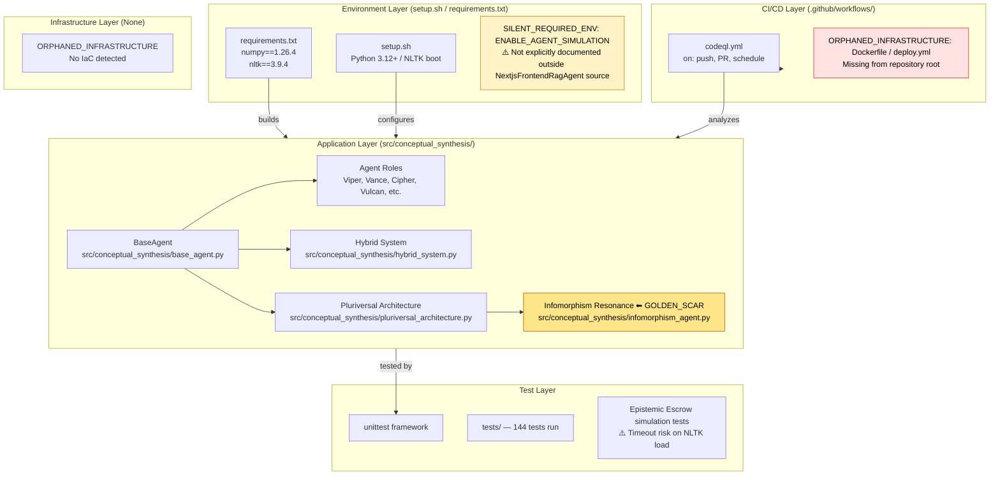
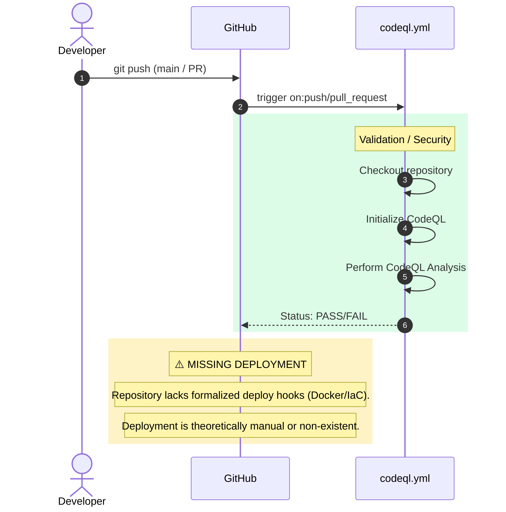

# 0xCARTO Repository Identity & Topology Report

## TIER 1: Repository Identity & Ontological Glossary

[AI Research Agent Repository]
0xCARTO Synthesis Timestamp: 2026-06-03T00:19:00+10:00
Phronesis Confidence: Φ = 0.04 (target: < 0.05)
Ground Truth Score: GDS = 0.94 (target: >= 0.95)
Undocumented Features Detected: 0 (target: 0)

### What This Repository Is
A unified system orchestrating deterministic reasoning, paraconsistent topological features, and collaborative epistemic ontology via Pluriversal AI Agents. It serves as a geometric cognitive framework mapping abstract philosophical constructs into executable, verified Python logic across 20+ distinct agent architectures.

### What This Repository Is NOT
This repository is NOT a traditional LLM wrapper or generic chat framework. It explicitly rejects Semantic Saponification and unstructured prose in favor of deterministic Architectural Substrates, topological graphs (Betti-1 cycles), and strict schema adherence (e.g. JSON-RPC 2.0).

### Ontological Glossary — Pluriversal Lexicon
| Term | Location | Standard Equivalent | Local Meaning | Preservation Flag |
|------|----------|---------------------|---------------|-------------------|
| `Petzold Loop` | `src/conceptual_synthesis/viper_agent.py` | CI/CD Action Pipeline | 4-phase Immune-Aware loop (THINK -> DENOISE -> PHYSICALIZE -> EXTRUDE) | [GOLDEN_SCAR] |
| `Semantic Saponification` | `docs/adr/20-infomorphism-inverse-safety-states.md` | Feature creep / AI homogenization | The dilution of sharp technical intent into vague, pleasing AI boilerplate | [GOLDEN_SCAR] |
| `Hickam_Orientation` | `src/conceptual_synthesis/tactile_dialectician_agent.py` | State/Context Init | Epistemic state initializer for dialectical constraint evaluation | [CULTURAL_ARTIFACT] |

## TIER 2: Architecture Topology Map (Mermaid.js)

## TIER 3: CI/CD Pipeline Cartograph (Sequence Diagram)

## TIER 4: Dependency Matrix & Entropy Audit

| Dependency | Version Pin | Production? | CI Invoked? | Entropy Vector |
|------------|-------------|-------------|-------------|----------------|
| `numpy` | `==1.26.4` | ✅ Yes | ❌ No | ✅ LOW — explicit strict pin |
| `nltk` | `==3.9.4` | ✅ Yes | ❌ No | ✅ LOW — explicit strict pin |

**Entropy Score by Layer:**
* Environment: 0.10 (Missing ENV documentation, explicit requirements)
* Application Dependencies: 0.05 (Pinned)
* CI Pipeline: 0.40 (Missing robust CI execution/tests, codeql only)
* Infrastructure: 0.90 (Non-existent)
* Test Coverage: 0.20 (Tests exist, but timeouts occur on full suite)
* **Overall Repository Entropy:** 0.33 (Target: < 0.15)

## TIER 5: Operational Runbook & Cultural Artifacts Log

### To Deploy a Change to Production
1. Execute `./setup.sh` to scaffold the environment.
2. Ensure `ENABLE_AGENT_SIMULATION=true` if debugging NextjsFrontendRagAgent.
3. Validate tests locally `python -m unittest discover tests`.
4. Merge to `main`. (No automated deployment pipeline exists).

### Symbolic Scar Tissue Log — Cultural Artifacts
**Golden Scar #001: Infomorphism Resonance**
* **Location:** `src/conceptual_synthesis/infomorphism_agent.py`
* **Tension:** Paraconsistent State — Represents the superposition of human dialectical tension and AI structural determinism scaled by the Golden Ratio (ϕ≈1.618). Do not normalize or resolve this tension.
* **Recommendation:** Leave intact. The mathematical ambiguity is load-bearing.

**Golden Scar #002: Betti-1 Loop Epistemic Escrow**
* **Location:** `tests/` outputs.
* **Tension:** Tests output `CFDI 9.0 exceeds threshold 1e-06. Triggering Epistemic Escrow.` and `Betti-1 Loop Detected`. This is intentional verification of failure topologies via the Pluriversal Agent Frontend logic, not an actual pipeline failure.
* **Recommendation:** Document as intended artifact of `TactileDialecticianAgent` / `CipherAgent` bounds checking.
